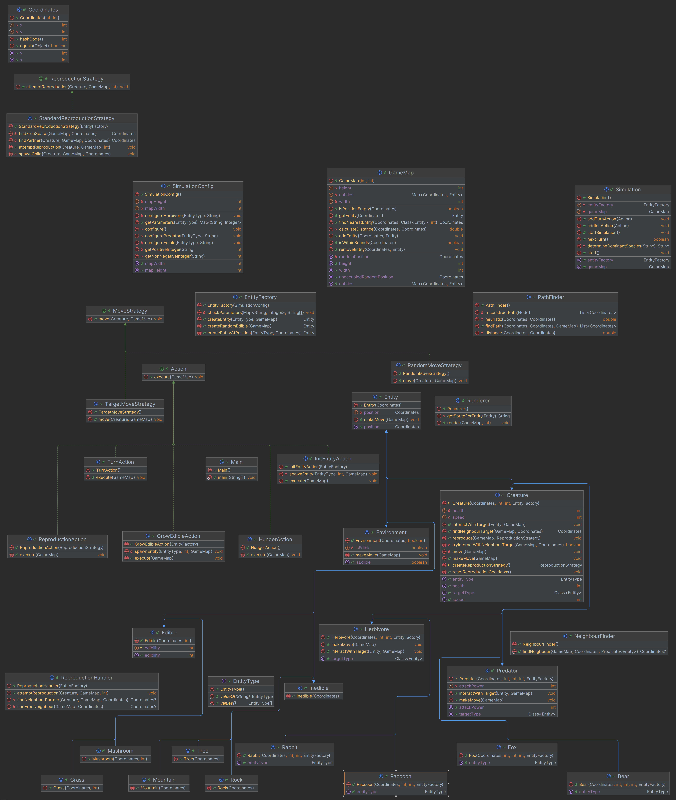

# Симуляция (Simulation)

## Описание
Реализация пошаговая симуляции 2D мира, населённого травоядными и хищниками, согласно ТЗ: [https://zhukovsd.github.io/java-backend-learning-course/projects/hangman/](https://zhukovsd.github.io/java-backend-learning-course/projects/simulation/)

## Диаграмма классов:

## Скриншоты
1. Начало игры: 

2. Настрйка параметров симуляции: 
3. Игровой процесс: 
4. Завершение игры: 

 
